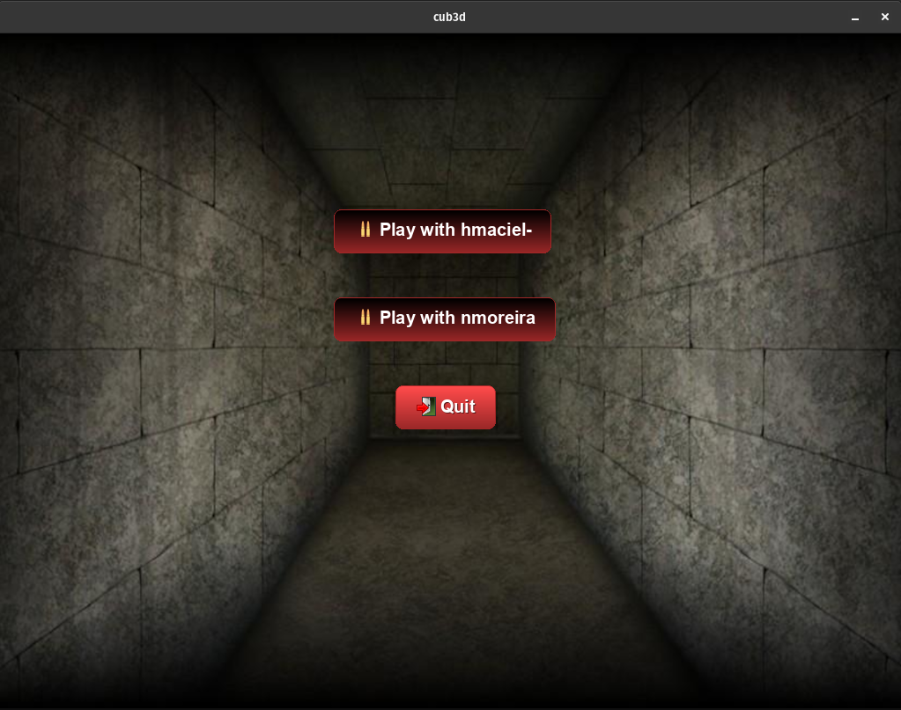
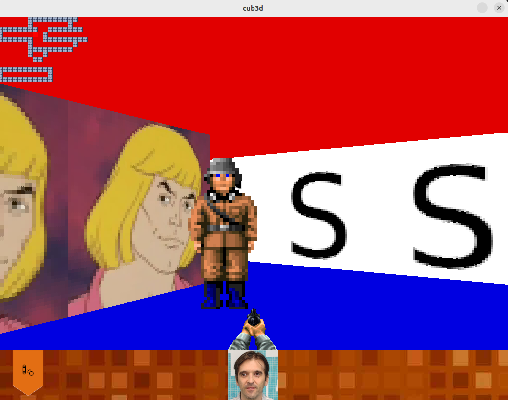

# cub3D
A RayCasting Adventure with miniLibX

## Overview
**cub3D** is a 42 school project inspired by the iconic Wolfenstein 3D, the pioneer of first-person shooter games. This project explores ray-casting techniques to create a dynamic, 3D graphical representation of a maze from a first-person perspective. Developed in collaboration with [Heitor Maciel](https://github.com/HeitorMP), it leverages the miniLibX library for rendering.

The goal is to navigate through a maze, rendered in real-time, using ray-casting principles to simulate a 3D environment.

## Features
- **First-Person Perspective**: Explore a maze with a realistic 3D view.
- **Customizable Configuration**: Define textures, colors, and map layouts via `.cub` files.
- **Interactive Gameplay**: Move and rotate within the maze, avoiding walls.
- **miniLibX Integration**: Lightweight graphics library for rendering the 3D environment.

## Configuration File
The program requires a `.cub` configuration file as a command-line argument. Example files are available in the `maps/` directory. The file must include:
- **Textures**: Paths to textures for North, South, East, and West walls.
- **Colors**: RGB values for floor - F and ceiling - C.
- **Map**: A grid where:
  - `1` represents walls.
  - `0` represents walkable floor spaces.
  - `N`, `S`, `E`, or `W` indicates the player's starting position and orientation.

Example configuration (`maps/example.cub`):
```
NO ./textures/north.xpm
SO ./textures/south.xpm
WE ./textures/west.xpm
EA ./textures/east.xpm
F 220,100,0
C 225,30,0
111111
100001
10N001
111111
```

## Installation
1. Clone the repository:
   ```bash
   git clone <repository_url>
   cd cub3D
   ```
2. Compile the project:
   ```bash
   make
   ```
   For the bonus version:
   ```bash
   make bonus
   ```

## Usage
Run the program with a `.cub` file:
```bash
./cub3D maps/example.cub
```
For the bonus version:
```bash
./cub3D_bonus maps/example.cub
```

## Controls
- **WASD**: Move forward, backward, left, and right.
- **Arrow Keys**: Rotate the camera.
- **ESC**: Exit the game.

## Screenshots

*Menu*:  


*Gameplay*:  
  


## What I Learned
- **Ray-Casting**: Implemented ray-casting algorithms to render a 3D environment from 2D data.
- **Graphics Programming**: Gained experience with miniLibX for rendering and event handling.
- **File Parsing**: Developed robust parsing for `.cub` configuration files.
- **Collaboration**: Worked effectively in a team to design and implement the project.

## Notes
- **Function Line Limit**: Each function is designed to respect the 25-line limit, which may require careful structuring of the code.
- **Function File Limit**: Each file has a limit of 5 functions

## Authors
- **Names**: Nuno Taboada, [Heitor Maciel](https://github.com/HeitorMP),
- **Emails**: nunotaboada@gmail.com

This project was completed as part of the 42 school curriculum

<a href="https://www.42porto.com/pt/">
 		
</a>